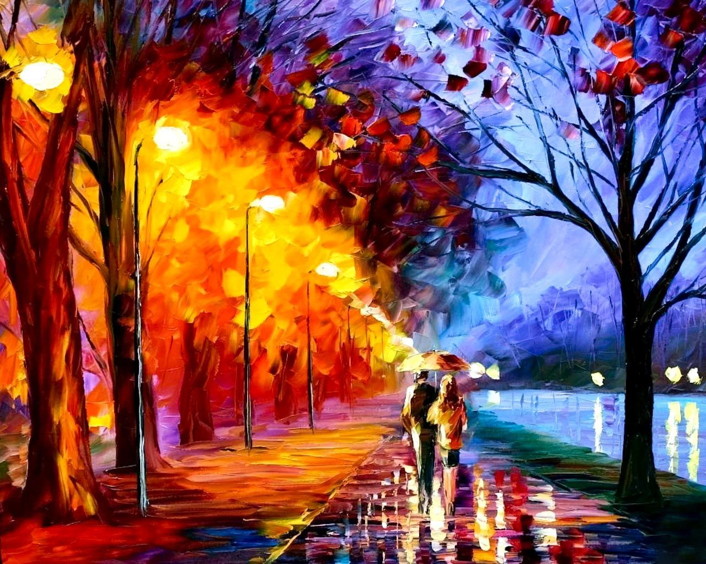
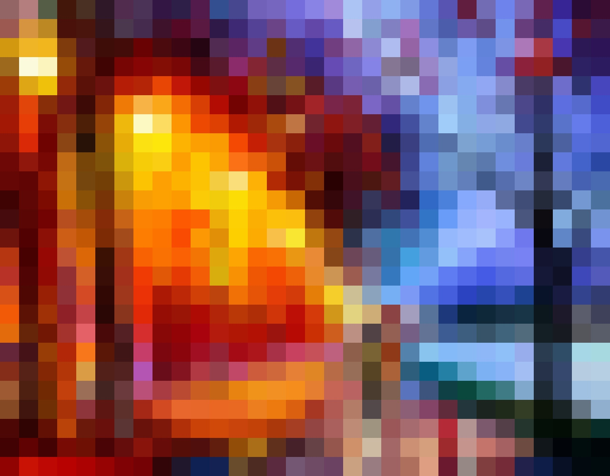
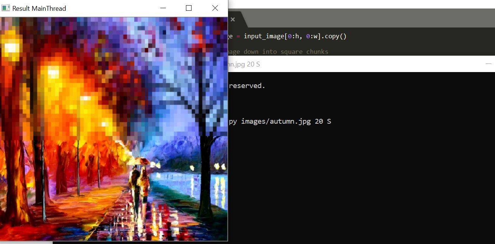
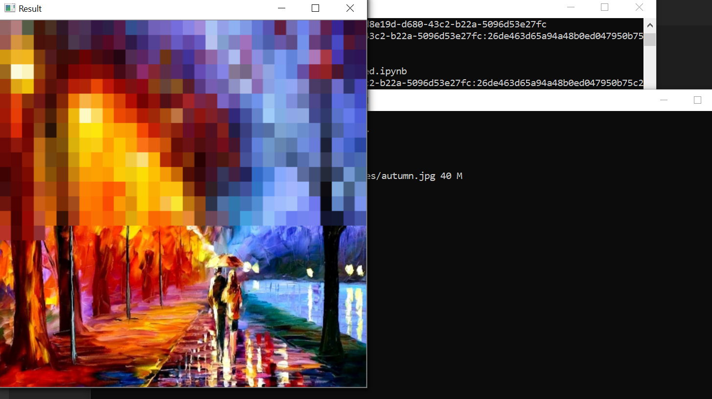

<!-- TABLE OF CONTENTS -->
<details open="open">
  <summary>Table of Contents</summary>
  <ol>
    <li>
      <a href="#about-the-mini-project">About The Mini-Project</a>
      <ul>
        <li><a href="#built-with">Built With</a></li>
      </ul>
    </li>
    <li>
      <a href="#getting-started">Getting Started</a>
      <ul>
        <li><a href="#prerequisites-and-installation">Prerequisites and Installation</a></li>
        <li><a href="#important-disclaimer">Important Disclaimer</a></li>
      </ul>
    </li>
    <li><a href="#usage">Usage</a></li>
    <li><a href="#how-it-works">How It Works</a></li>
      <ul>
        <li><a href="#program-flow">Program Flow</a></li>
      </ul>
  </ol>
</details>

<!-- ABOUT THE MINI-PROJECT -->
## About The Mini-Project




The goal of this mini-project is to enable image pixelation in single- and multi-threaded processing modes.

Specifically, the following procedure must be performed to pixelate a given image:
- From left to right, top to bottom find the average color for the ``square_size`` x ``square_size`` boxes and set the color of each box to its respective average. Progress is to be shown as each chunk of the image is processed.
- Either of the two processing modes can be chosen: single- or multi-threaded programming. In the case of multi-threaded processing, the number of threads is to be equal to the number of CPU cores.
- The resulting image is then saved in the current working directory as ``result.jpg``.

The images attached above are examples of the original image and the resulting pixelated image.

### Built With

The following main libraries were used to build this mini-project:
- <a href="https://pypi.org/project/opencv-python/">openCV</a>
- <a href="https://docs.python.org/3/library/threading.html">threading</a>

<!-- GETTING STARTED -->
## Getting Started

This is a list of instructions on how anyone can get started with this code.

### Prerequisites & Installation

1. Clone the repo
```sh
    git clone https://github.com/ADA-GWU/assigment-3-njamalova.git
```
2. Install packages, if not installed
```sh
    pip install threading
    pip install opencv-python
```
### Important disclaimer

The code was developed on the Windows OS, so in case of any program problems, ``please ensure you are using Windows with this code``.

<!-- USAGE EXAMPLES -->
## Usage

To run this code, three arguments should be taken from the command line: file name, square size and processing mode.

Example of how to run the program on somefile.jpg with square size 10 and single-threaded mode:
``` sh
    pixelater.py somefile.jpg 10 S
```
Example of how to run the program on somefile.jpg with square size 10 and multi-threaded mode:
``` sh
    pixelater.py somefile.jpg 10 M
```
The processed image will be saved under ``result.jpg`` in the current working directory.


Here is a screenshot of the progress displayed in the single-threaded mode:



Here is a screenshot of the progress displayed in the multi-threaded mode:



## How It Works

The script has a ``Runner`` class with the following methods:
- ``chunker``: will adjust the dimensions of the input image in such a way that they can be evenly divided by the square size. This method will also store the coordinates of each chunk (i.e. square) in an array (class variable).
- ``multi_pixelizer``: will set the channel color of each chunk to the average color of that channel. This method will change the input image in place. It is to be used for multi-threading.
- ``single_pixelizer``: will set the channel color of each chunk to the average color of that channel. This method will change the input image in place. At the same time, it shall display the progress chunk-by-chunk. It is to be used for single-threading.
- ``processor``: will perform pixelation either in single- or multi-threaded mode. In the multi-threaded mode, will display the progress so long as threads are active. This method will return the final fully processed image.

The elapsed time will also get printed at the end of processing.

### Program Flow

1. ``main`` is called. Arguments passed through the command line are parsed.
2. Inside ``main``, ``Runner`` class is instantiated with the parsed arguments.
2. ``chunker`` is called on the instantiated object. Adjusted input image (``self.pixelated_image``) and coordinates of chunks (``self.boxes``) are computed and updated, as class variables.
3. ``processor`` is called afterwards with the argument ``input_image``. Depending on the chosen mode, either creates multiple or single threads. The number of threads in the multi-mode equals to the number of CPU cores.
4. Inside ``processor``, in case of multi-threaded mode, each thread's target is ``multi_pixelizer`` with arguments ``n_jobs_per_thread``, ``input_image`` and ``lock`` to prevent unwanted memory clashes. Each ``multi_pixelizer`` (i.e. thread) shall perform averaging on the ``self.pixelated_image`` . Progress shall be displayed chunk-by-chunk.
In case of single-threaded mode, ``single_pixelizer`` is called and it shall display progress chunk-by-chunk until nothing is left in ``self.boxes``.
5. ``processor`` shall return the final fully processed ``self.pixelated_image``, which will be saved as ``result.jpg`` in ``main``. Elapsed time is then printed.

